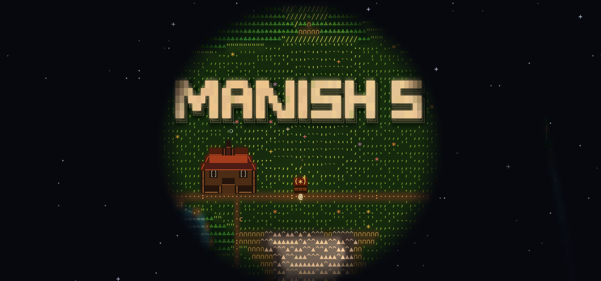

<div align="center">

<a href="https://manishh-13.github.io/"></a>

# manishh-13.github.io

**A living ASCII island you can walk around. Every building on it is something I built.**

[**Visit the island &rarr;**](https://manishh-13.github.io/)

</div>

## What's on the island

| Where | What |
| --- | --- |
| the workshop | Hi, that's me. |
| the windmill | [Scaling Visualiser](https://manishh-13.github.io/lambda-scaling-visualiser/): watch serverless functions scale |
| the x-ray lab | [URL X-Ray](https://manishh-13.github.io/url-x-ray/): see the internet behind a link |
| the lighthouse | [IP Map](https://manishh-13.github.io/aws-ip-map/): who owns this IP address? |
| ??? | not telling. Go and look. |

## Things to try

- Walk with <kbd>WASD</kbd> or the arrow keys, or click anywhere and the `@` finds its own way there.
- Stay for a minute. The sun sets, the stone letters start to glow and the lighthouse switches on.
- The island only shows what you have seen, and it remembers what you found next time you visit.
- Pet the cat.

| Key | Does |
| --- | --- |
| <kbd>WASD</kbd> / arrows / click / tap | walk |
| <kbd>E</kbd> or <kbd>Enter</kbd> | open the building you are standing at |
| <kbd>Esc</kbd> | close it |
| <kbd>M</kbd> | minimap |
| <kbd>N</kbd> | skip ahead in time |
| <kbd>+</kbd> / <kbd>-</kbd> | zoom |

## How it's made

No frameworks, no build step, no dependencies. Two plain JavaScript files and one canvas.

- **[gen.js](gen.js)** grows the whole world from one number. Fractal value noise for height and moisture, a clearing for the campfire, the name carved in the ANSI Shadow figlet font, landmarks placed by a nearest-fit site search, and roads between them carved with A*.
- **[island.js](island.js)** draws it as living ASCII. Every cell gets a glyph and a soft painted background; wind rolls across the grass, the sea shimmers, clouds drift their shadows over the land, and a day and night cycle lights everything with point lights and a rotating lighthouse beam. Each cell decodes into place the first time you see it.
- Everything on the island is also on the page as plain HTML underneath it, so search engines and screen readers get the full list. It respects `prefers-reduced-motion`.

## Run it locally

```sh
python3 -m http.server 8000      # then open http://localhost:8000
node --test 'test/*.test.cjs'    # generator tests
```
